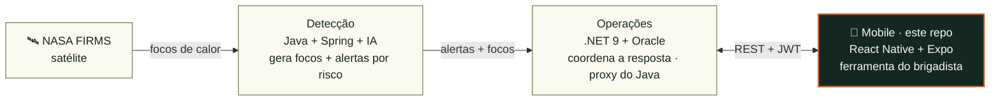
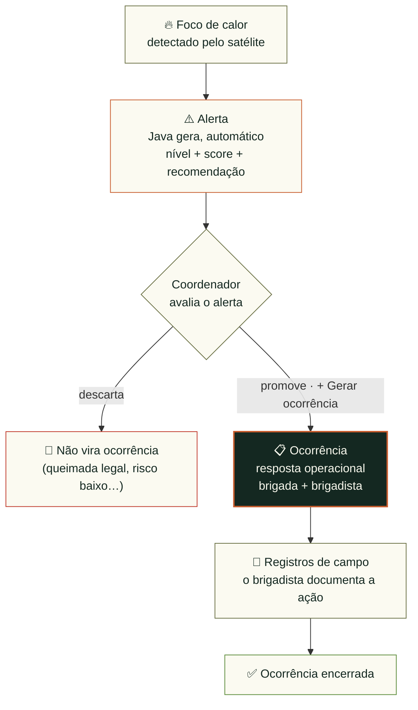

<p align="center">
  
</p>

<p align="center"><i>O vigia de cem olhos — sistema operacional de combate a incêndios florestais.</i></p>

<p align="center">
  <b>Global Solution 2026/1 · FIAP</b> · 2º ano de Análise e Desenvolvimento de Sistemas<br/>
  Disciplina: <b>Mobile Application Development</b>
</p>

<p align="center">
  
  
  
  
  
</p>

<p align="center">
  <a href="https://expo.dev/accounts/annabonfim/projects/argus-mobile/builds/1090f75e-6b1d-48e0-bf22-f812d1ce1006">
    
  </a>
</p>

---

# Argus Mobile 🔥

**Ferramenta de campo do brigadista** no sistema **Argus** — um app React Native +
Expo que coloca na mão de quem combate o fogo os dados que vêm do espaço. É a camada
onde a detecção por satélite vira **ação no terreno**.

Incêndios florestais costumam ser vistos cedo pelo satélite e tarde por quem está em
campo. O Argus fecha essa lacuna: aplica a **economia espacial** — os dados abertos da
**NASA FIRMS** — a um problema concreto do chão, coordenando a resposta de brigadas a
focos de calor reais, **do alerta ao encerramento da ocorrência**.

Este app é a **ponta operacional** dessa cadeia. O brigadista **tria os alertas**
gerados a partir do satélite, **promove** os críticos a ocorrências, acompanha o
trabalho da **própria brigada**, **avança o status** em campo e **registra cada ação
com GPS** — tudo contra uma API REST, com autenticação **JWT** e **autorização por
papel**.

O Argus é composto por **três camadas**, cada uma um domínio próprio (e uma entrega da
GS): a **detecção** (Java + IA, lê o satélite e gera alertas priorizados por risco), as
**operações** (.NET 9 + Oracle, coordena brigadas, recursos e ocorrências) e o **campo**
(este app, onde o brigadista age). O mobile conversa **só com a .NET**, que orquestra as
duas pontas e expõe uma origem única de dados.

## 🛰️ A solução (Global Solution 2026/1)

> *"O espaço é a nova fronteira."* — Satélites monitoram o clima e evitam desastres.
> O Argus usa os dados abertos de satélite da **NASA FIRMS** para detectar focos de
> calor, priorizá-los por risco e coordenar a resposta de brigadas florestais.

| Camada | Stack | Papel |
|---|---|---|
| 🛰️ **Detecção** | Java + Spring + IA | Ingere dados da **NASA FIRMS**, filtra os focos de calor, calcula score de risco e gera **alertas** com recomendação operacional. |
| ⚙️ **Operações** | .NET 9 + Oracle | Coordena a resposta humana: brigadas, brigadistas, recursos, ocorrências e registros de campo. Expõe a **API REST** e faz **proxy** dos alertas/focos do Java. |
| 📱 **Campo** *(este repo)* | React Native + Expo | O brigadista em campo: tria alertas, promove ocorrências, atualiza status, registra ações com GPS e gerencia a equipe. |

**ODS atendidos:** 13 (Ação climática), 15 (Vida terrestre), 11 (Cidades sustentáveis), 9 (Inovação).

## 🎯 Para o avaliador — em 4 passos

| Passo | O que fazer |
|---|---|
| 1️⃣ | Abrir o app — [**instalar via Firebase App Distribution**](https://appdistribution.firebase.dev/i/011a10d2381aec34), baixar a [APK no EAS Build](https://expo.dev/accounts/annabonfim/projects/argus-mobile/builds/1090f75e-6b1d-48e0-bf22-f812d1ce1006), ou rodar localmente (ver [Como executar](#-como-executar)) |
| 2️⃣ | Logar como **`admin@argus.com` / `Admin@123`** |
| 3️⃣ | **Alertas** → filtrar por **Crítico** → abrir um alerta → **"+ Gerar ocorrência"** → preencher → criar |
| 4️⃣ | **Mapa** → ver os focos do satélite, dar zoom, buscar por região (ex.: "Pantanal") |

## 📹 Vídeo demonstração

🎥 **[Assista no YouTube](https://youtu.be/2FBIzb-WXX8)** — tour de ~5 min pelo app: login, triagem de alerta crítico, geração de ocorrência, mapa de focos e registros de campo.

## 🏗️ Arquitetura



O app mobile tem **uma única origem de dados (a API .NET)**. Quem conversa com o Java é
a .NET, que repassa focos e alertas. Isso mantém o cliente simples e desacoplado da
camada de inteligência.

## 🔄 Do satélite à ação (ciclo de vida)



**Detecção é automática, resposta é humana:** o Java alerta, mas é o coordenador que
decide agir. **Nem todo alerta vira ocorrência** — só quando vira, a brigada responde e
documenta tudo em registros de campo até o encerramento.

## 🧠 Decisões de design

| Decisão | Por quê |
|---|---|
| **App fala só com a .NET** (não chama o Java direto) | Uma origem só, cliente desacoplado; a .NET é o *backend-for-frontend* que agrega as duas APIs. |
| **Alerta ≠ Ocorrência** | Detecção é **automática** (Java alerta); resposta é **humana** — o coordenador *promove* o alerta a ocorrência. Nem todo alerta vira ação (queimada legal, risco baixo, falso positivo). |
| **Alertas por *polling* (15s)** | Alternativa pragmática ao push/FCM: o app atualiza em segundo plano enquanto a tela está visível e dá um **toast** quando chega um alerta crítico/alto. Pausa em background pra não gastar bateria/cota. |
| **Brigada → Brigadista em cascata** | Integridade: o responsável tem que pertencer à brigada designada. O dropdown de brigadista só mostra membros da brigada escolhida. |
| **Autorização por papel** | Criar/editar/excluir e promover alertas são de Admin/Coordenador; o brigadista atua só na **própria brigada** — escondido no app **e** validado por `403` no backend. |
| **Brigadista avança status, não edita** | Mudar o status usa um `PATCH /ocorrencias/{id}/status` dedicado (liberado ao brigadista da brigada responsável); a edição completa fica no `PUT`, exclusivo de Admin/Coordenador. |
| **"Minha brigada"** | O brigadista tem uma aba só com as ocorrências da própria brigada — escopo de trabalho claro, sem ruído das demais. |
| **Google Maps key via `.env`** | Mantém a chave **fora do repositório** (`app.config.js` injeta no build). |

## 👥 Perfis de usuário

| Perfil | Acesso |
|---|---|
| **Admin** | Tudo: gerencia usuários, brigadas, brigadistas, recursos; cria/exclui ocorrências; promove alertas. |
| **Coordenador** | Coordena a operação: cria ocorrências, promove alertas, gerencia equipe. |
| **Brigadista** | Em campo: vê alertas/ocorrências e a aba **Minha brigada**; avança o status e registra ações nas ocorrências da própria brigada. |

## 📱 Telas (20 no total)

**Públicas (autenticação)**
- **Login** — autenticação JWT real
- **Cadastro** — signup com código de convite (`ARGUS-2026`)
- **Sobre o app** — versão, build e hash do commit *(acessível pelo login)*

**Início e satélite**
- **Início** — indicadores (alertas críticos, ocorrências abertas, brigadistas ativos) + atalhos
- **Mapa de focos** — focos do FIRMS no mapa, coloridos por intensidade (FRP), com zoom e busca por região
- **Alertas** + **Detalhe do alerta** — lista com filtro por criticidade; detalhe com recomendação e botão "Gerar ocorrência"

**Operações (CRUD)**
- **Ocorrências** + **Detalhe** + **Formulário** — CRUD completo
- **Minha brigada** — ocorrências atribuídas à brigada do brigadista logado
- **Formulário de registro de campo** — registros aninhados na ocorrência
- **Brigadas** + **Detalhe** + **Formulário** — gestão de equipes
- **Formulário de brigadista** — cadastro de membros
- **Recursos** + **Formulário de recurso** — veículos e equipamentos (CRUD via detalhe da brigada)

**Administração**
- **Usuários** — listagem de todos os usuários do sistema *(somente Admin)*

**Conta**
- **Perfil** — edição self-service dos próprios dados + logout

## 🔑 Credenciais de teste

| Perfil | E-mail | Senha |
|---|---|---|
| Admin | `admin@argus.com` | `Admin@123` |
| Brigadista | `brig@argus.com` | `Brig@123` |

Código de convite para cadastro: **`ARGUS-2026`**

## 🛠️ Tecnologias

| Categoria | Tecnologia |
|---|---|
| Framework | **Expo SDK 56** · React Native 0.85 · React 19 |
| Linguagem | **TypeScript** (strict) |
| Navegação | **Expo Router** (file-based: tabs + stack + modais, rotas tipadas) |
| HTTP | **Axios** (interceptor de Bearer + tratamento de 401) |
| Auth/sessão | **expo-secure-store** (persistência do token JWT) |
| Mapa | **react-native-maps** (Google Maps) + geocoding via Nominatim |
| Localização | **expo-location** (GPS) |
| UI | **@expo/vector-icons** (Ionicons) · fontes **Oswald + Inter** |
| Datas / feedback | **date-fns** · **react-native-toast-message** |
| Build / distribuição | **EAS Build** · **Firebase App Distribution** |

## ✅ CRUD via API (.NET)

Operações de **Create, Read, Update e Delete** consumindo a API .NET com Axios — os
dados são sempre manipulados via API, nunca apenas no dispositivo.

| Entidade | C | R | U | D | Quem |
|---|:-:|:-:|:-:|:-:|---|
| **Ocorrências** | ✅ | ✅ | ✅ | ✅ | Coordenação cria/edita/exclui; brigadista avança o status (na própria brigada) |
| **Registros de campo** | ✅ | ✅ | ✅ | ✅ | Brigadista, aninhados na ocorrência da própria brigada |
| **Brigadas** | ✅ | ✅ | ✅ | ✅ | Admin/Coordenador |
| **Brigadistas** | ✅ | ✅ | ✅ | ✅ | Admin/Coordenador |
| **Recursos** | ✅ | ✅ | ✅ | ✅ | Admin/Coordenador (via detalhe da brigada) |
| **Perfil** | — | ✅ | ✅ | — | O próprio usuário |
| **Alertas / Focos** | — | ✅ | — | — | Leitura (vindos do Java) + promoção a ocorrência |

Feedback visual em tudo: **loaders**, **toasts** de sucesso/erro e mensagens
amigáveis extraídas do `ProblemDetails` do backend.

## 🚀 Como executar

Duas formas de abrir o app — **instalar a APK pronta** (rápido, sem buildar) ou
**rodar o projeto localmente**.

### Opção 1 — Instalar a APK pronta 📲

O app está **publicado no Firebase App Distribution**. Abra o convite, aceite e
baixe a APK direto no Android:

📲 **[Instalar via Firebase App Distribution](https://appdistribution.firebase.dev/i/011a10d2381aec34)**

Alternativa de download direto: **[APK no EAS Build](https://expo.dev/accounts/annabonfim/projects/argus-mobile/builds/1090f75e-6b1d-48e0-bf22-f812d1ce1006)**. A versão publicada corresponde ao commit exibido na tela **Sobre** do app.

### Opção 2 — Rodar localmente 💻

**Pré-requisitos**
- Node 20+ e `npx`
- A **API .NET** (Argus Operations) rodando — local ou na nuvem
- Um **development build** (o app **não roda no Expo Go**, por causa do `react-native-maps`)
- No Android, uma **Google Maps API key** (Maps SDK for Android)

```bash
npm install

# 1. Google Maps key — copie o modelo e preencha:
cp .env.example .env
# edite .env:  GOOGLE_MAPS_API_KEY=sua_chave_aqui

# 2. URL da API (opcional):
#    Por padrão o app já aponta pra API .NET publicada na Azure.
#    Para rodar contra a .NET local, sobrescreva:
export EXPO_PUBLIC_API_URL="http://10.0.2.2:5215"   # Android emu (iOS sim: localhost:5215)

# 3. Dev build:
npx expo run:android   # ou run:ios
```

## 📂 Estrutura do projeto

```
src/
├── api/            # cliente axios + um serviço por recurso
│   ├── client.ts        # baseURL + interceptors (Bearer, 401→logout)
│   ├── auth.ts          # login, signup, perfil
│   ├── alertas.ts       # listar/obter alerta + promover a ocorrência
│   ├── ocorrencias.ts   # CRUD de ocorrências
│   ├── registros.ts     # registros de campo
│   ├── brigadas.ts · brigadistas.ts · recursos.ts · focos.ts · usuarios.ts
│   └── errors.ts        # getErrorMessage (ProblemDetails → texto amigável)
├── app/            # rotas (Expo Router)
│   ├── (auth)/          # login, signup
│   ├── (protected)/     # início, alertas, ocorrências, mapa, minha-brigada, usuários…
│   ├── *-detalhe.tsx    # telas de detalhe
│   ├── *-form.tsx       # formulários de CRUD
│   └── sobre.tsx
├── components/     # UI reutilizável (Button, TextField, Select, Badge, Fab…)
├── context/        # AuthContext — estado global de sessão
├── hooks/          # useResourceList — loading/erro/refresh de listas
├── lib/            # formatação, máscaras, geolocalização, mapas, labels
├── theme/          # paleta de cores, espaçamento, tipografia
└── types/          # tipos do domínio (espelham os DTOs do backend)
```

Separação de responsabilidades: **telas** (`app/`) consomem **serviços** (`api/`); o
estado de sessão vive no **Context**; listas reaproveitam o hook `useResourceList`; e
a UI compartilhada fica em `components/`.

## 🔗 Repositórios relacionados

- ⚙️ **Operações — .NET 9 + Oracle:** [annabonfim/argus-operations-dotnet](https://github.com/annabonfim/argus-operations-dotnet)
  - API publicada (backend que este app consome): [argus-operations (Azure)](https://argus-operations-rm559561.azurewebsites.net)
- 🛰️ **Detecção — Java + Spring + IA:** [alanerochaa/argus-intelligence-api](https://github.com/alanerochaa/argus-intelligence-api)
  - API publicada: [argus-intelligence-api (Azure)](https://argus-intelligence-api-abe6g6facyh4fgfm.eastus-01.azurewebsites.net)

## 👩‍💻 Integrantes

| Nome | RM | Responsabilidades |
|---|---|---|
| Anna Beatriz de Araujo Bonfim | 559561 | Mobile (este app) · .NET (Operations API) · Compliance/TOGAF |
| Alane Rocha da Silva | 561052 | Java Advanced (Intelligence API + RabbitMQ) · PL/SQL · Compliance |
| Maria Eduarda Araujo Penas | 560944 | DevOps & Cloud (Azure Pipelines) · Disruptive Architectures (IoT) |
